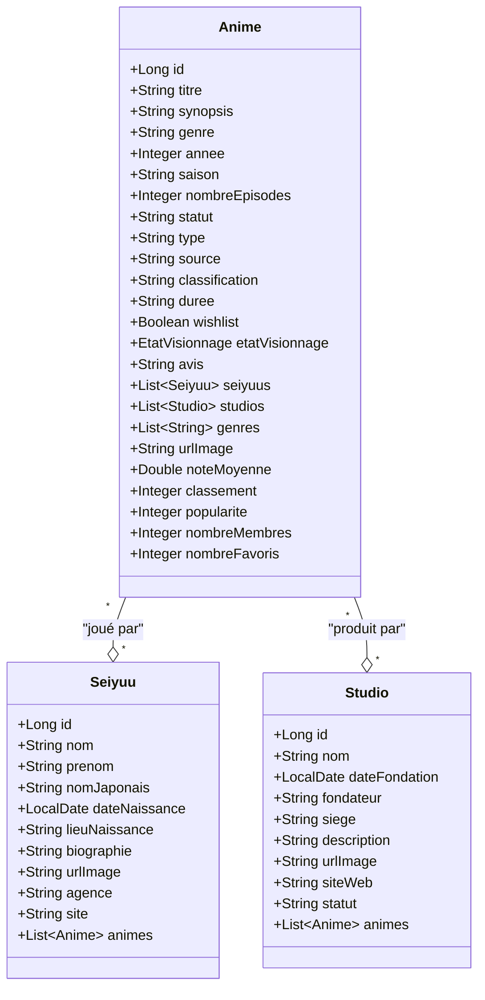
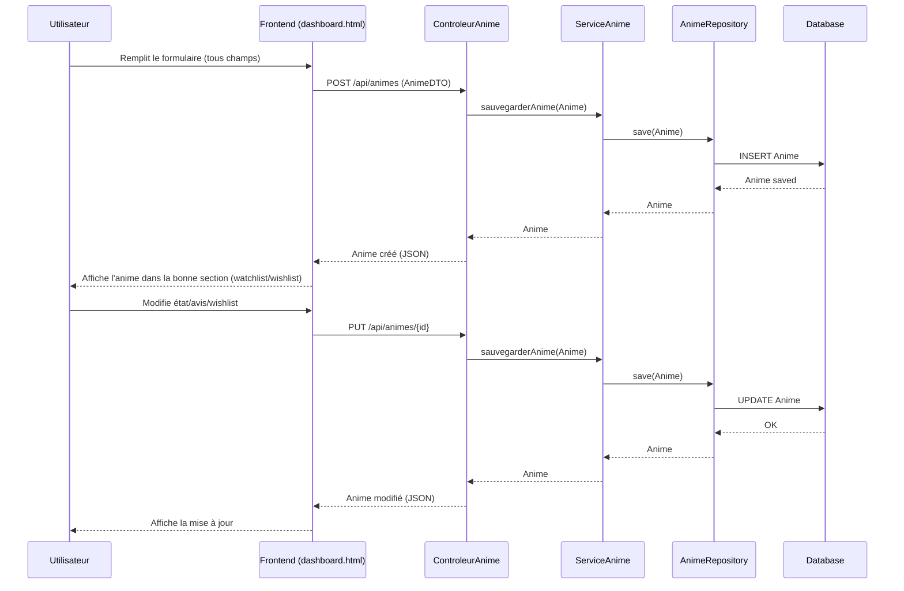
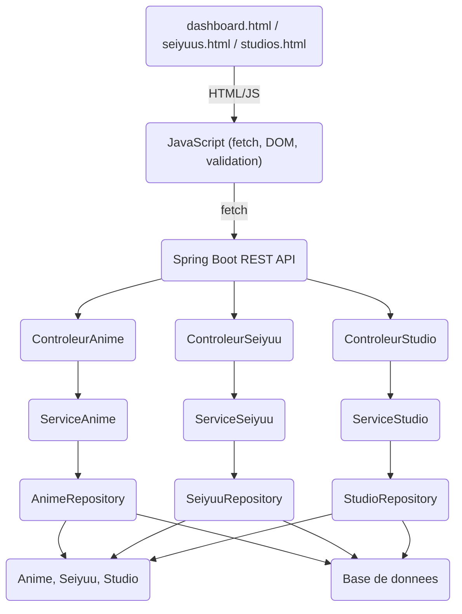
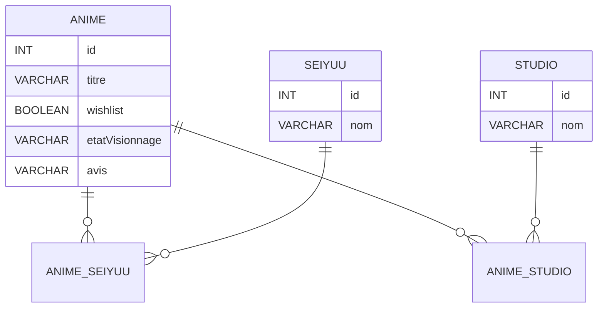
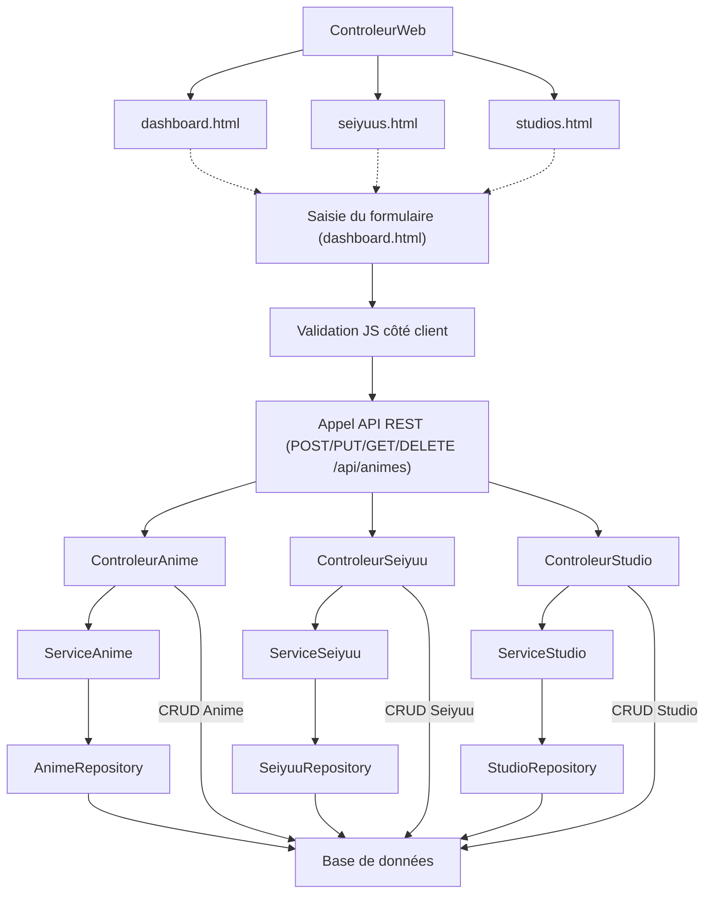
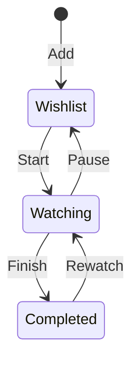
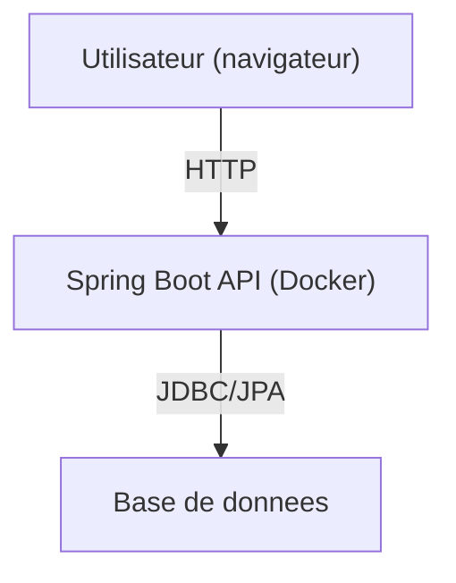

# Diagrammes Mermaid complets et valides

## Diagramme de classes (ultra détaillé)

## Diagramme de séquence (exhaustif)

## Diagramme d'architecture / composants (ultra détaillé)

## Diagramme ERD (relationnel)

## Diagramme de flow (flux complet)

## Diagramme d'état (états de visionnage)

## Diagramme de déploiement

## Diagramme de cas d'utilisation (use case complet)

```mermaid
flowchart TD
    user[Utilisateur]
    addAnime[Ajouter un anime]
    editAnime[Modifier un anime]
    deleteAnime[Supprimer un anime]
    viewWatchlist[Voir la watchlist]
    viewWishlist[Voir la wishlist]
    moveToWishlist[Déplacer vers la wishlist]
    moveToWatchlist[Déplacer vers la watchlist]
    changeEtat[Changer etat de visionnage]
    leaveAvis[Laisser un avis]
    addSeiyuu[Ajouter un seiyuu]
    editSeiyuu[Modifier un seiyuu]
    deleteSeiyuu[Supprimer un seiyuu]
    viewSeiyuus[Voir les seiyuus]
    addStudio[Ajouter un studio]
    editStudio[Modifier un studio]
    deleteStudio[Supprimer un studio]
    viewStudios[Voir les studios]
    searchAnime[Rechercher un anime]
    searchSeiyuu[Rechercher un seiyuu]
    searchStudio[Rechercher un studio]
    user --> addAnime
    user --> editAnime
    user --> deleteAnime
    user --> viewWatchlist
    user --> viewWishlist
    user --> moveToWishlist
    user --> moveToWatchlist
    user --> changeEtat
    user --> leaveAvis
    user --> addSeiyuu
    user --> editSeiyuu
    user --> deleteSeiyuu
    user --> viewSeiyuus
    user --> addStudio
    user --> editStudio
    user --> deleteStudio
    user --> viewStudios
    user --> searchAnime
    user --> searchSeiyuu
    user --> searchStudio
    addAnime --> moveToWatchlist
    addAnime --> moveToWishlist
    moveToWishlist --> viewWishlist
    moveToWatchlist --> viewWatchlist
    changeEtat --> viewWatchlist
    leaveAvis --> viewWatchlist
``` 
